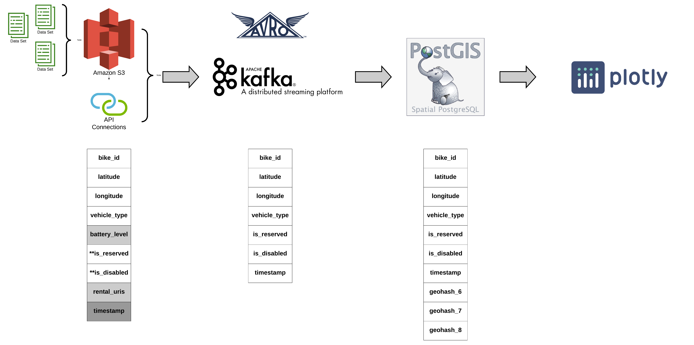

# Micromobility Utilizer
This is my Insight Data Engineering project (Summer 2020). It is a platform for micromobiltiy operators to utilize their assets.

## How to install and get it up and running

## Introduction
Micromobility refers to all shared-use fleet of small, lightweight, and fully or partially human-powered vehicles such as Ebikes, electric scooters, electric skateboards, shared bicycles, and electric pedal-assisted (pedelec) bicycles. They primarily address the transit desert or first/last mile problem in urban areas. 

The shared micromobility operators compete in a highly competitive market with a low-profit margin. Some of the major players operating in the market are Citi Bike, Lime, Bird, Spin, Jump, Bolt, and Skip. They need to move around their inventory to capture more demand and increase their revenue. 

The micromobility utilizer is a platform to provide operators with analytics dashboard reporting KPIs like idle time per vehicle, average available vehicle per operators, etc. 

## Architecture
The data are stored in an Amazon S3 bucket from where it is streamed into Apache Kafka. A Confluent Kafka cluster is set up on X Amazon EC2 nodes. Also, a schema registry is configured that handles the evolution of the data schema. Avro is chosen as a serialization format to work with the schema registry.

A PostGIS server resides on an additional EC2 node. PostGIS was chosen to allow for spatial queries. This allows us to filter the data by the proximity of a users position. The Plotly Dash web application is hosted on another EC2 node. Dash was chosen since it easily integrates Mapbox. 

## Dataset

## Engineering challenges

1. Inconsistent Schema

Problems:

Operators' rideshare data have different schemas. They might also evolve over time. New versions might not be compatible with older schemas. To avoid downtime of the pipeline, the update to newer code versions needs to happen during production time.

Solutions:

Confluent Kafka uses a schema registry that allows the evolution of the data schema. Adding default values to the data schema allows for full backward and forward compatibility between old and new versions of the Kafka applications. These versions can then run in simultaneously and process and consume messages of all schema versions.

2. Point Data Aggregation

Problems:
Because of GPS signal error, point data with slightly different latitudes and longitudes represent the same location. 

Solutions:
Geohashing techniques is used to aggregate point data and generate KPIs for visualization.

## Trade-offs
